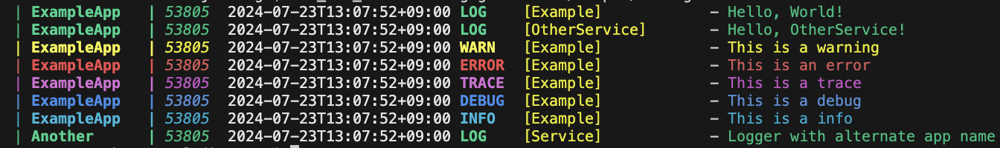
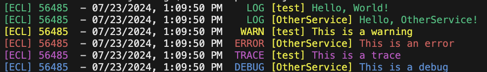
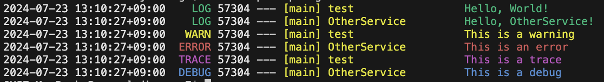

# Enhanced Coloured Logger for Go (ECL)


This is a utility logger that print the logs in with colour of the log level.

Example: 

Please note that is project is still in work-in-progress.

## Log structure

A typical log is consisted of the following components

`[App name] Time LOGLEVEL [Logger Name] Message`

- App name
  - The name of the app. This will help identify the source app of the log
- Time
  - The time of the log creation. `time.Time` type
- Log Level
  - The log level. (LOG, TRACE, DEBUG, INFO, WARN, ERROR, FATAL, PANIC)
- Logger Name
  - The name of the logger. Pass in the name of the component (struct name, method name) to help identify the source of the log
- Message
  - The message of the log

## Basic Usage

### Initialization

The Logger shares a global context for the App's name. Set this by calling the `SetAppName` method from the logger. If the `SetAppName` is not called, then the default app name `GoApp` will be used.

The logger can be instantiated using `ecl.NewLogger`. At least the name of the logger must be given through the init options

```golang
import logger "github.com/jhseong7/ecl"

func main() {
  // Instantiate a new Logger
  l := logger.NewLogger(logger.LoggerOption {
    Name: "ThisLogger"
  })

  // Default text log
  l.Log("Hello world!")

  // Formatted version
  l.Logf("%s", "Hello World!")
}
```

All Levels of the logger provide a formatting version `~f` thus allows a formatted string to be used in the log.

### Log Levels

ECL supports the following log levels:

- All
- Trace
- Debug
- Info
- Warn
- Error

The log level can be set using `SetLogLevel` method from the logger. If the `SetLogLevel` is not called, then the default log level `All` will be used.

```golang
import "github.com/jhseong7/ecl"

func main() {
  // Set the global log level
  ecl.SetLogLevel(ecl.Warn)
  l := ecl.NewLogger(ecl.LoggerOption {
    Name: "ThisLogger"
  })

  // Or set log level for a specific logger
  l2 := ecl.NewLogger(ecl.LoggerOption {
    Name: "Logger2"
    LogLevel: ecl.All
  })

  // This will not be printed
  l.Log("Hello world!")

  // This will be printed
  l2.Warn("Hello world!")
}
```

### Log style

ECL supports the following log styles:

- Default
- NestJS
- Spring

The style can be set using 2 methods:

1. Set the environment variable `LOG_STYLE` to the desired style
2. Set the global log style by calling the `SetLogStyle` method from the logger

Calling the `SetLogStyle` method from the logger. If the `SetLogStyle` is not called, then the default style `Default` will be used.

```golang
import logger "github.com/jhseong7/ecl"

func main() {
  // Set the global log style
  ecl.SetLogStyle(ecl.SpringStyle)

  // Or set log style for a specific logger
  l := ecl.NewLogger(ecl.LoggerOption {
    Name: "ThisLogger"
    LogStyle: ecl.SpringStyle
  })
}
```

Default log style:


NestJS style log:



Spring style log:



## Advanced usage

### Extra streams (Custom Logger)

The logger provides an interface spec that the user can provide to acquire the logs and manipulate in their own manner.

```golang
type (
  LogMessage struct {
    AppName string
    Time    string
    Name    string
    Color   string
    Level   string
    Msg     string
  }

  ILogStream interface {
    Write(msg LogMessage)
  }
)
```

Any struct that satisfies the `ILogStream` interface can be injected with the logger

For example, the default extrastream `FileLogStream` util can be initialized like below to write the same logs of the stdout to a rollover filestream

```golang
l := ecl.NewLogger(ecl.LoggerOption{
  Name: "test",
  ExtraStreams: []ecl.ILogStream{
    ecl.NewFileLogStream(ecl.FileLogStreamOption{
      LogDirectory: "./logs",
      FileName:     "app",
    }),
  },
})
```

If you want to enable a specific extra stream global so every new logger has the custom extra stream.

```golang
ecl.AddGlobalExtraStream([]ecl.ILogStream{
  ecl.NewFileLogStream(ecl.FileLogStreamOption{
    LogDirectory: "./logs",
    FileName:     "app",
  }),
})

// Both loggers below will write a file log
l := ecl.NewLogger(ecl.LoggerOption {
  Name: "Logger 1",
})

l2 := ecl.NewLogger(ecl.LoggerOption {
  Name: "Logger 2",
})
```

### File Log Stream

This is a default log stream that writes the logs to a file for persistance.

The initializer options are as follows

```golang
FileLogStreamOption struct {
  LogDirectory  string
  FileName      string
  FileRollover  bool
  MaxFileSizeKb int
}
```

- LogDirectory
  - The directory that the logs are saved to. The directory is created automatically if not exists
- FileName
  - The file name prefix of the log file. If the `RollOver` options is not enabled, then the file name would be `${FileName}.log`
  - If the Rollover is enabled, `${FileName}.${Date}.log` will be used
- FileRollover
  - (WIP) If `true`, the logfile will move on when the date changes
- MaxFileSizeKb (Not supported Yet)
  - If the Log's size reaches this size in KB, a new log file is created

## Run Samples

Samples are located in the `cmd` directory. A Makefile is provided to easily run the samples.

Run `make help` to see the available commands
